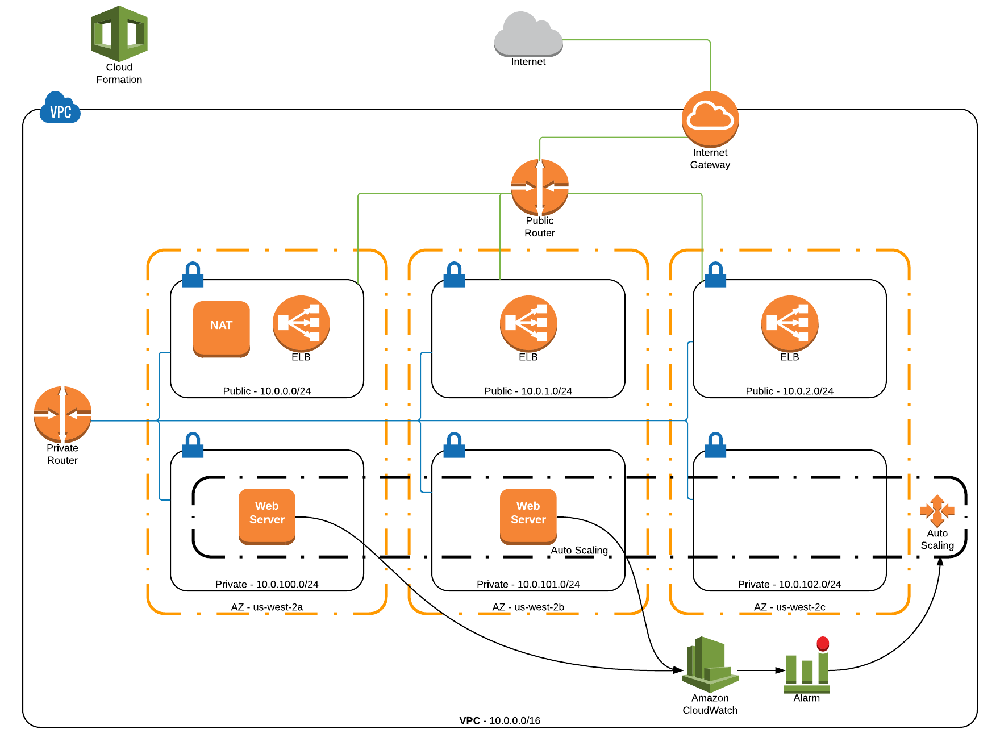

# Overview
This project utilizes an AWS [CloudFormation](https://aws.amazon.com/cloudformation/) template to provision a stack to serve up a static HTML page via an [NGINX](https://www.nginx.com/) web server.

<center>`Deployment Diagram`</center>



# Architectural Components

### Security
The following components were utilized for securing the environment:

* **VPC** - A VPC is used to restrict public internet access from as many instances as possible.
* **Private Subnet** - A private subnet is created in each AZ for the web server instances to restrict public internet access
* **Public Subnet** - The only hosts in the public subnets are the ELBs and a NAT server 
* **NAT Instance** - The NAT server exists to allow the web servers in the private subnets to access public resources that are needed during deployment, for example accessing GitHub to download and deploy the static HTML page. 
* **Bastion Host** - For simplicity, the NAT server is also serving as a bastion host.  All SSH access to the web servers must be done via this bastion host.
* **Network ACL** - Separate Network ACLs are created for the public and private subnets.  The public ACLs are locked down to only allow the traffic that is needed for the application to perform.
* **Security Group** - Separate security groups exist for the ELBs, the NAT instance, and the web server instances.  The security groups control the flow of traffic as seen in the diagram above.
* **CloudTrail** - All API traffic is captured to an S3 bucket via CloudTrail to ensure that any changes to the system are logged.  Additionally, versioning is enabled on the bucket to ensure nothing can be deleted.  The logs are deleted after 365 days with a lifecycle policy.

### Cost-efficiency
The following components were leveraged in an effort to make the most cost-efficient system:

* **Auto Scaling Groups* - An auto scaling group was created for the web server instances to allow the instances to scale up automatically based on load and then scale back down when traffic subsides.  A minimum of 2 instances will always be running but a maximum of 4 can be provisioned if load demands it.  This enables only paying for the utilization that is required for the current load.
* **CloudWatch Metrcis** - Auto scaling is triggered up or down based on metrics coming out of cloudwatch for the instances.  Currently, the CPU metric is used to determine the need for more or less instances.
* **t2.micro** - The t2.micro instance type was chosen for the NAT instance and the web server hosts to limit cost (free tier eligible)

Note, the most cost-efficient solution would be to just push the static HTML page to an S3 bucket and then enable [Static Website Hosting](http://docs.aws.amazon.com/AmazonS3/latest/dev/WebsiteHosting.html)...but where is the fun in that?

### Reliability
The reliability of the site is achieved with the following components:

* **Auto Scaling Groups** - The system will auto scale under load to ensure that the system is still available when traffic patterns change.  Additionally, the auto scaling groups will ensure a minimum of 2 instances are always running and will automatically reprovision a new one if one of the existing ones terminates.
* **CloudWatch Metrcis** - Metrics from CloudWatch measure the health of the systems and trigger auto scaling actions based on metric values to ensure the instances are all running at healthy levels.
* **Multiple AZs** - The web servers are deployed in multiple availability zones to ensure that the system is still available even in the event of a service outage in one of the AZs.
* **Elastic Load Balancers** - A cross zone ELB is configured in front of the web server instances to evenly balance the load across the instances.  Also the ELB uses an HTTP monitor to measure the health of each web server instance and will pull instances out of service if they are unhealthy.
* **Blue-Green Deployments** - The system allows [Blue-Green Deployments](http://martinfowler.com/bliki/BlueGreenDeployment.html) to be performed to improve the reliability of the system, even during an upgrade.  The process would consist of using the CloudFormation template to provision a new stack and then using Route53 [weighted round-robin](http://docs.aws.amazon.com/Route53/latest/DeveloperGuide/routing-policy.html) to send only small percentage of traffic to the new stack (also referred to as canary deployment).  The traffic is then gradually moved to the new stack and the old is eventually turned off. 
* **Infrastructure Testing** - The CloudFormation init script for each web server includes a test to validate that the correct static page is being served by the web server.  If the test doesn't pass, the server is terminated.

### Performance
Performance of the site is accomplished with the following components:

* **Auto Scaling Groups** - Auto scaling ensures the system is serving up pages in acceptable response times.
* **CloudFront** - The CloudFront CDN should front end the site to improve downloads for users in different geographic regions.  **This still needs to be done**

# Creating the Stack via AWS CLI

Ensure that you have the AWS CLI installed configured as per the [user guide](http://docs.aws.amazon.com/cli/latest/userguide/installing.html).

```
aws cloudformation create-stack --stack-name aftp \
    --template-url  https://s3-us-west-2.amazonaws.com/cplee-cfn/stack.template \
    --parameters ParameterKey=KeyName,ParameterValue=my-keyname  \
    --capabilities "CAPABILITY_IAM" 
```

The following parameters can be provided to the template:

**Parameter** | **Description**
--------------|----------------
**KeyName** | The EC2 key pair to install on the NAT instance and web server instances.  (**REQUIRED**)
**NATSSHAllow** | The CIDR block from which to allow SSH access to the NAT instance (Default: **0.0.0.0/0**)
**WebServerInstanceType** | The instance type to use for the web servers (Default: **t2.micro**)
**AppRepo** | The GitHub repository to pull the static HTML page from (Default: **cplee/aftp**)
**AppCommit** | The commit id (branch, tag or SHA) to install from. (Default: **master**)

# CloudTrail
In order to audit the API calls in your AWS account, CloudTrail should always be enabled.  You can use the provided CloudFormation template to enable it:

```
aws cloudformation create-stack --stack-name cloudtrail \
    --template-url  https://s3-us-west-2.amazonaws.com/cplee-cfn/cloudtrail.template
```

# Creating the Stack via AWS SDK
There is a utility in [bin/manager.rb](bin/manager.rb) that creates the stack.  Before running, you'll need to have Ruby installed and run `bundle install`

```
./bin/manager.rb create -k my-keyname
```

The following options can be provided to control the creation of the CloudFormation stack:


**Parameter** | **Description**
--------------|----------------
-k,--key-name  | The EC2 key pair to use for the NAT and web server instances (**REQUIRED**)
-n,--stack-name  | The name to use for the stack (Default: **aftp**)
-r,--region  | The region to use for the stack (Default: **us-west-2**)
-a,--app-repo  | Name of GitHub repo to use (Default: **cplee/aftp**)
-c,--app-commit | The commit id (branch, tag or SHA) to install from. (Default: **master**)


You can then destroy the stack with:

```
./bin/manager.rb delete
```

The following options can be provided to control the deletion of the CloudFormation stack:

**Parameter** | **Description**
--------------|----------------
-n,--stack-name  | The name of the stack to delete (Default: **aftp**)
-r,--region  | The region to use for the stack (Default: **us-west-2**)


